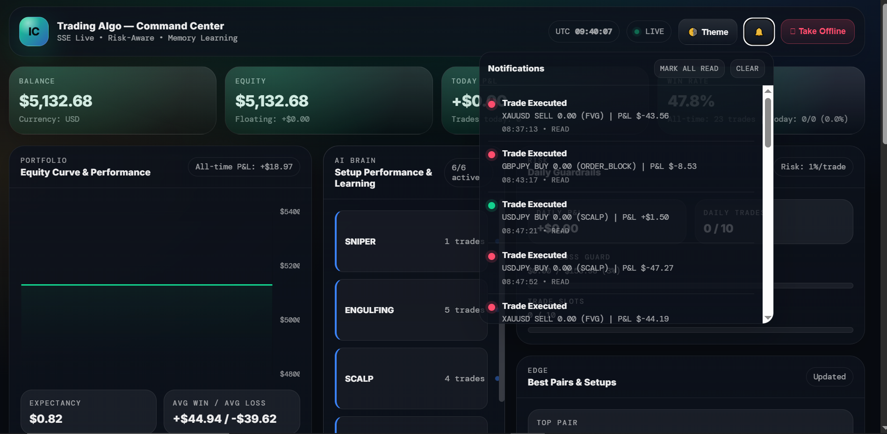

<div align="center">

# 🤖 ICT Trading Algorithm

**A fully automated Forex trading bot powered by ICT Smart Money Concepts —**  
**validated across 16 months of data and enhanced with a trained ML brain.**

[](https://python.org)
[](https://metatrader5.com)
[](LICENSE)
[]()
[]()
[]()

*Trades EUR/USD · GBP/USD · USD/JPY — London Open & London Close*

</div>

---

## ⚠️ Risk Disclaimer

> **Trading involves substantial risk of loss. This bot does NOT guarantee profits. Never trade with money you cannot afford to lose. Always test on a demo account first.**

---

## 📸 Dashboard

<div align="center">



*Real-time command center — equity curve, AI brain performance, daily guardrails, live notifications*

</div>

---

## 📖 What Is This?

A fully automated trading bot that watches the market, identifies high-probability setups using **ICT Smart Money Concepts**, and automatically places, manages, and closes trades on **MetaTrader 5** — with zero manual intervention.

What separates this from every other ICT bot: **every parameter is data-proven.** Sixteen rigorous backtesting passes across 16 months of real M5 tick data eliminated every setup, pair, direction, and session that didn't perform. What remained is a lean, validated edge. On top of that, a trained **XGBoost ML model** filters low-probability signals in real time — improving the Profit Factor from 1.23 to **1.40** on 6 months of data it had never seen.

---

## 🧠 Trading Strategy

### Active Setups

| Setup | What It Does | 16-Month PF |
|-------|-------------|-------------|
| 🔴 **CHOCH** | Change of Character — detects structural market shifts and enters on the reversal | 1.15 |
| 🟡 **LSR** | Liquidity Sweep Reversal — identifies stop hunts at key levels and fades the move | 1.17 |

> Every other setup (FVG, Order Block, Pin Bar, HH/HL Continuation) was tested and disabled after confirmed underperformance across 16 months of data.

### Direction Filters — Proven by Data

| Pair | Direction | 16-Month Result |
|------|-----------|----------------|
| **EUR/USD** | Both ✅ | Balanced both ways |
| **GBP/USD** | SELL only ✅ | BUY bleeds -454p |
| **USD/JPY** | BUY only ✅ | SELL bleeds -492p |

### Sessions — London Only

| Session | UTC | Gaborone |
|---------|-----|----------|
| 🇬🇧 **London Open** | 06:00 – 09:00 | 08:00 – 11:00 |
| 🔁 **London Close** | 15:00 – 17:00 | 17:00 – 19:00 |

> NY Open excluded — bleeds -384p across 16 months. Every session was tested.

---

## 🤖 The ML Brain

Every signal passes through a trained **XGBoost classifier** before any trade opens:

```
CHOCH or LSR signal fires
        ↓
Brain checks: symbol + direction + setup + session + hour + day
        ↓
Win probability < 50%  →  signal skipped silently
Win probability ≥ 50%  →  trade opens normally
```

**Results on 6 months of completely unseen data (Sep 2025 – Feb 2026):**

| | No Brain | With Brain |
|--|---------|-----------|
| **Profit Factor** | 1.23 | **1.40** |
| **Win Rate** | 64.7% | **66.8%** |
| **$/week @ $10K** | ~$119 | **~$140** |

The brain independently learned the same patterns the manual autopsy found:  
direction alignment, early London Open hour, Monday bias, GBPUSD SELL, EURUSD SELL.

---

## 🎯 Instruments Traded

| Instrument | Type | Session |
|-----------|------|---------|
| **EUR/USD** | Forex Major | London Open + Close |
| **GBP/USD** | Forex Major | London Open + Close |
| **USD/JPY** | Forex Major | London Open + Close |

---

## 🏗️ Architecture

```
ict_trading_bot/
│
├── 📁 01_LIVE_BOT/                   ← Core trading engine
│   ├── bot_engine.py                 ← Master loop — scans pairs every 10s
│   ├── ict_strategy.py               ← Signal detection + Brain Gate hook
│   ├── ict_advanced_setups.py        ← CHOCH + LSR detection library
│   ├── risk_manager.py               ← Position sizing + daily limits
│   ├── brain_gate.py                 ← ML filter (loads once, fails safe)
│   └── trade_manager.py              ← Giveback guard + trailing logic
│
├── 📁 02_BACKTESTER/                 ← Historical simulation (16 passes run here)
│
├── 📁 03_BACKTEST_RESULTS/           ← 16 months of validated results
│   ├── pass_13/ → pass_16/           ← Every pass saved and organized
│   └── README.txt                    ← What each pass tested and found
│
├── 📁 04_BRAIN/                      ← ML learning system
│   ├── models/entry_model.pkl        ← Trained XGBoost (28 features)
│   ├── training_data/features_clean.csv ← 1,123 trades, zero data leakage
│   ├── step1_extract_features.py     ← Clean feature extraction
│   ├── step2_train_entry_model.py    ← Model training with time-series CV
│   └── run_full_brain_pipeline.py    ← Train everything in one command
│
├── 📁 05_DATA/                       ← 16 months M5 data (5 pairs)
├── 📁 06_CONFIG/                     ← Settings (credentials gitignored)
├── 📁 07_LOGS/                       ← Daily activity logs
├── 📁 08_DOCS/                       ← Plain English guides
│
├── START_BOT.py                      ← One click to start
├── STOP_BOT.py                       ← One click to stop
└── CHECK_PERFORMANCE.py              ← Print today's results
```

---

## 🔄 System Workflow

```
Every 10 seconds during kill zones:

  Market data arrives
       ↓
  Kill zone check ──── Outside LO/LC? → Sleep
       ↓
  CHOCH + LSR scan
       ↓
  Direction filter ─── GBPUSD BUY? → Skip
                  ─── USDJPY SELL? → Skip
       ↓
  Brain gate ─────── Win prob < 50%? → Skip
       ↓
  Risk check ─────── Daily loss > 3.5%? → Stop for day
                  ── 3 consecutive losses? → Pause 2hrs
       ↓
  Enter trade (1% risk, hard SL)
       ↓
  Manage with giveback guard (0.5R activation, 15% max giveback)
       ↓
  Exit + log to CSV + update brain training data
```

---

## 📊 Validated Performance

*Nov 2024 – Feb 2026 | XM broker M5 data | $10K account @ 1% risk*

| Stage | Trades/wk | Win Rate | Profit Factor | $/week |
|-------|-----------|----------|---------------|--------|
| Raw baseline (all setups) | 13.4 | 64.7% | 1.06 | +$44 |
| + Direction filters | 8.9 | 64.2% | 1.16 | +$67 |
| + Guard tuning 0.5R/15% | 8.9 | 64.2% | 1.18 | +$72 |
| **+ ML Brain (live system)** | ~5.6 | **66.8%** | **1.40** | **$119–178** |

---

## 🛡️ Risk Management

```
✅ Risk per trade       →  1.0% ($100 on $10K)
✅ Max risk (A+ setup)  →  1.5% ($150 on $10K)
✅ Daily loss limit     →  3.5% = $350 — stops for the day
✅ Daily profit lock    →  3.0% = $300 — protects good days
✅ Max total drawdown   →  8.0% = $800 — account protection
✅ Loss streak pause    →  3 consecutive losses → 2hr timeout
✅ Max open trades      →  3 simultaneous positions
✅ Brain gate           →  ML skips low-probability signals
✅ Direction filter     →  Per-pair bias (data-proven, not guessed)
✅ Kill zone gate       →  London sessions only
```

---

## ⚡ Quick Start

### Prerequisites
- [Python 3.10+](https://python.org/downloads)
- [MetaTrader 5](https://metatrader5.com) with a broker account

### 1. Clone
```bash
git clone https://github.com/Batoli19/ict-trading-bot.git
cd ict-trading-bot
```

### 2. Install
```bash
pip install -r requirements.txt
```

### 3. Configure
```bash
# Windows
copy config\settings.example.json config\settings.json
```

```json
{
  "mt5": {
    "login":    12345678,
    "password": "your_mt5_password",
    "server":   "YourBroker-Demo"
  }
}
```

### 4. Train the brain *(optional — pre-trained model included)*
```bash
python 04_BRAIN/run_full_brain_pipeline.py
```

### 5. Start trading
```bash
python START_BOT.py
```

---

## 🔬 The 16-Pass Validation System

This bot wasn't built and shipped. It was validated.

| Pass | What Was Tested | Key Finding |
|------|----------------|-------------|
| 1–12 | Core strategy, datetime fixes, data pipeline | Foundation established |
| 13A | All 5 setups, 5 pairs, 16 months | FVG + OB = dead code |
| 14A | FVG and ORDER_BLOCK wired and tested | Both confirmed bleeders |
| 15 | Direction filters + guard matrix (12 combos) | PF 1.06 → 1.18 |
| 16 | Hard TP vs guard — LSR vs CHOCH split | LSR = hard TP, CHOCH = guard |
| Brain | XGBoost on 6 months unseen data | PF 1.23 → 1.40 confirmed |

---

## 🗺️ Roadmap

- [x] 16-pass backtesting validation
- [x] Direction filters per pair (data-proven)
- [x] Giveback guard tuning (0.5R/15%)
- [x] XGBoost ML brain — trained + wired live
- [x] $10K prop account configuration
- [ ] Pass 17 — Hybrid exit (LSR hard 1.5R TP)
- [ ] Pass 18 — Macro news circuit breaker
- [ ] Monthly brain retraining pipeline
- [ ] Multi-account scaling

---

## 🔧 Troubleshooting

| Problem | Solution |
|---------|---------|
| `MT5 connection failed` | Check login, password, server in `settings.json` |
| `No trades being placed` | Confirm it's London Open or London Close (UTC) |
| `Brain gate blocking everything` | Check `04_BRAIN/models/entry_model.pkl` exists |
| `USDJPY firing 0 trades` | Expected — USDJPY SELL is filtered by direction rules |
| `Bot stops mid-session` | Daily loss limit hit — check `07_LOGS/` |

---

## 🖥️ Running 24/7

For reliable 24/7 operation use a VPS:

| Provider | Price | Notes |
|----------|-------|-------|
| [Contabo](https://contabo.com) | ~$7/mo | Most affordable |
| [Forex VPS](https://forexvps.net) | ~$20/mo | MT5 optimized |
| [AWS Lightsail](https://lightsail.aws.amazon.com) | ~$10/mo | Most reliable |

---

## 📜 License

[MIT License](LICENSE) — free to use, modify, and distribute.

---

<div align="center">

**Built with ICT Smart Money Concepts · Validated with 16 months of data · Enhanced with ML**

*6,000+ backtested trades · XGBoost brain · Proven edge on unseen data*

*Not financial advice. Trade responsibly.*

</div>
